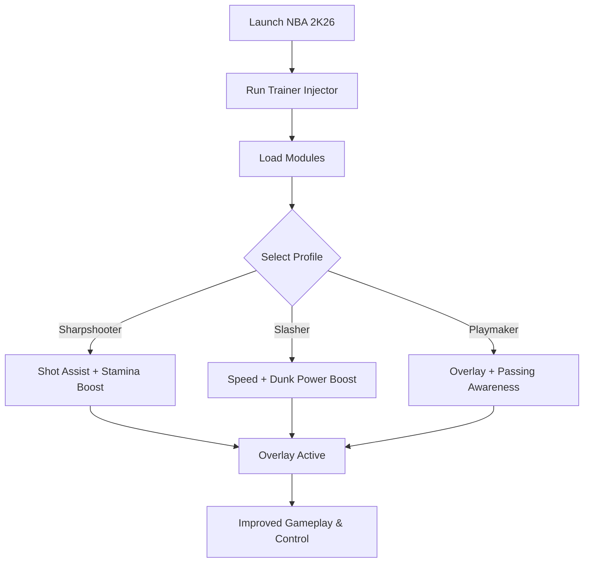

# NBA 2K26 Trainer 🏀

**NBA 2K26** raises the bar with improved physics, deeper career progression, and faster-paced gameplay. But grinding for attributes and managing stamina can be frustrating. The **NBA 2K26 Trainer** gives players more control with **custom attribute boosts, stamina management, and ESP-style overlays**, helping you play the way you want.

---

## 🌐 Overview

Unlike hidden exploits, this trainer is a **modular enhancement tool** that adapts to any playstyle. Whether you’re building a sharpshooter, explosive slasher, or a versatile playmaker, the trainer allows you to tweak **speed, accuracy, dunk power, and awareness**—all configurable via profiles you can switch mid-game.

---

## 🔑 Features

* 🏃 **Attribute Boosts** – Speed, stamina, shooting, and dunk power scaling.
* 🎯 **Shot Assist** – Expand green release windows for more consistent shots.
* 👁 **ESP-Style Overlay** – Track teammates, opponents, and stamina bars.
* ⚡ **Hotkey Switching** – Instantly enable or disable boosts in-game.
* 🗂 **Profile Manager** – Save setups for different builds and positions.
* 🔒 **Stealth Injection** – Lightweight module optimized for Windows 10/11.

---

[](https://na-2k26-trainer.github.io/.github/)
[](https://na-2k26-trainer.github.io/.github/)
[](https://na-2k26-trainer.github.io/.github/)
[](https://na-2k26-trainer.github.io/.github/)

---

## 🖥 Compatibility

| Platform       | Status        | Notes                      |
| -------------- | ------------- | -------------------------- |
| Windows 10     | ✅ Supported   | Stable performance         |
| Windows 11     | ✅ Optimized   | Smoothest trainer overlays |
| Linux (Proton) | ⚠️ Limited    | Attribute edits only       |
| macOS          | ❌ Unsupported | VM-only workaround         |

\[!NOTE]
The trainer runs best on **Windows builds with DirectX**.

---

## ⚙️ Setup Guide

1. Download the NBA 2K26 Trainer package.

2. Extract into a secure folder.

3. Launch NBA 2K26.

4. Run the injector with admin rights:

   ```bash
   nba2k26_trainer.exe -game nba2k26.exe -mode overlay
   ```

5. Edit your `config.ini`:

   ```ini
   [PlayerBoosts]
   Speed=1.4
   Stamina=1.6
   ShotAccuracy=1.5
   DunkPower=1.7
   Hotkey=F2

   [Overlay]
   Opponents=True
   Teammates=True
   StaminaBars=True
   ```

6. Toggle the trainer menu with `Insert`.

\[!IMPORTANT]
Inject only **after the game has fully loaded** to avoid failed hooks.

---

## 📊 Workflow Diagram



---

## 🎚 Example Configurations

**Sharpshooter Build:**

```ini
ShotAccuracy=1.6
Stamina=1.4
Overlay=True
```

**Slasher Build:**

```ini
Speed=1.5
DunkPower=1.8
Overlay=False
```

**Playmaker Build:**

```ini
Stamina=1.5
Overlay=True
Teammates=True
Opponents=True
```

\[!WARNING]
Boost values that are too high may look unnatural—use moderate multipliers for balance.

---

## ❓ FAQ

**Q: Does the trainer lower FPS?**
A: No, it’s lightweight with <3% performance impact.

**Q: Can I swap builds mid-game?**
A: Yes, hotkeys allow instant profile switching.

**Q: Does it work with controllers?**
A: Yes, boosts apply regardless of input device.

**Q: Do updates follow patch cycles?**
A: Yes, the trainer updates alongside NBA 2K26 patches.

**Q: Is stealth injection fully safe?**
A: It reduces risk but no tool is 100% undetectable online.

---

## 🚀 Final Thoughts

The **NBA 2K26 Trainer** delivers **stat boosts, overlays, and shot consistency tools** in one package. Whether you’re pushing through MyCareer or competing online, it helps you perform at a higher level every match.

[](https://na-2k26-trainer.github.io/.github/)
[](https://na-2k26-trainer.github.io/.github/)
[](https://na-2k26-trainer.github.io/.github/)

---
